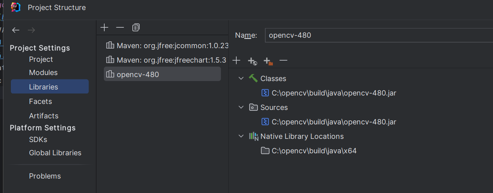

## Инструкция по установке и запуску проекта
1. Скачать и установить [JDK 21](https://www.oracle.com/java/technologies/downloads/#jdk21-windows)
2. Настроить переменную среды JAVA_HOME. [Инструкция](https://java-lessons.ru/first-steps/java-home)
3. Скачать и установить [IntelliJ IDEA Community Edition](https://www.jetbrains.com/ru-ru/idea/download/?section=windows)
4. Скачать и установить [OpenCV 4.8.0](https://opencv.org/releases/)
5. Добавить в переменную среды Path путь к OpenCV
6. Скачать проект и открыть его с помощью IntelliJ IDEA Community Edition
7. В Project Structure указать путь к OpenCV как тут 
8. Запустить проект зайдя в Main.java и нажать на кнопку плэй